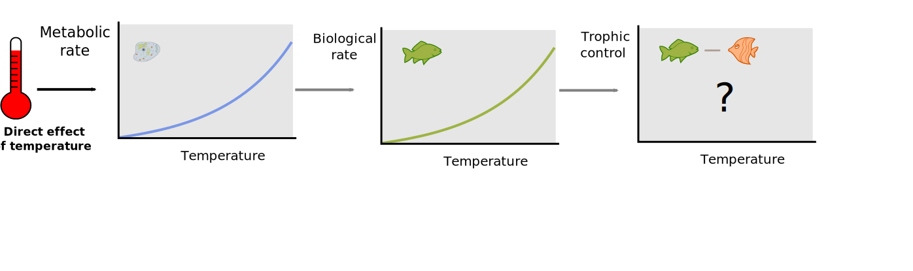
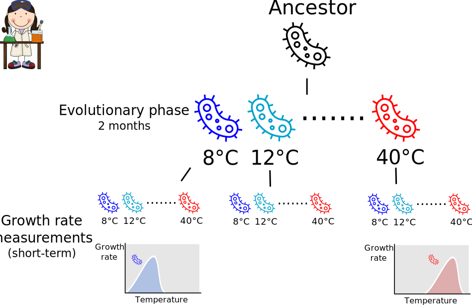
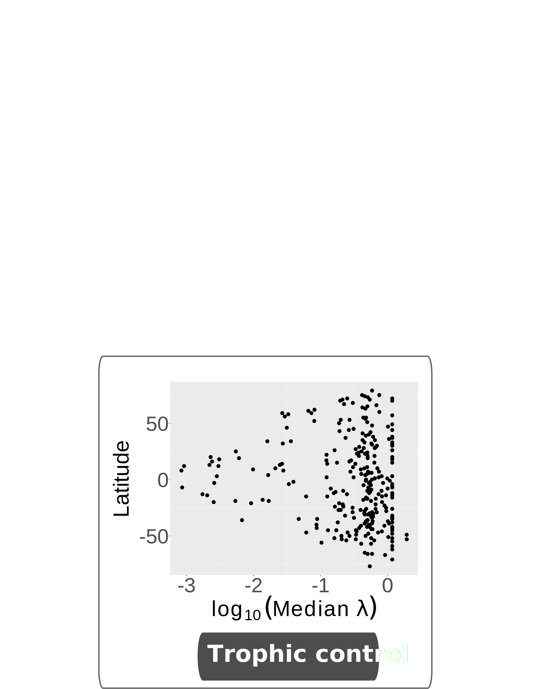
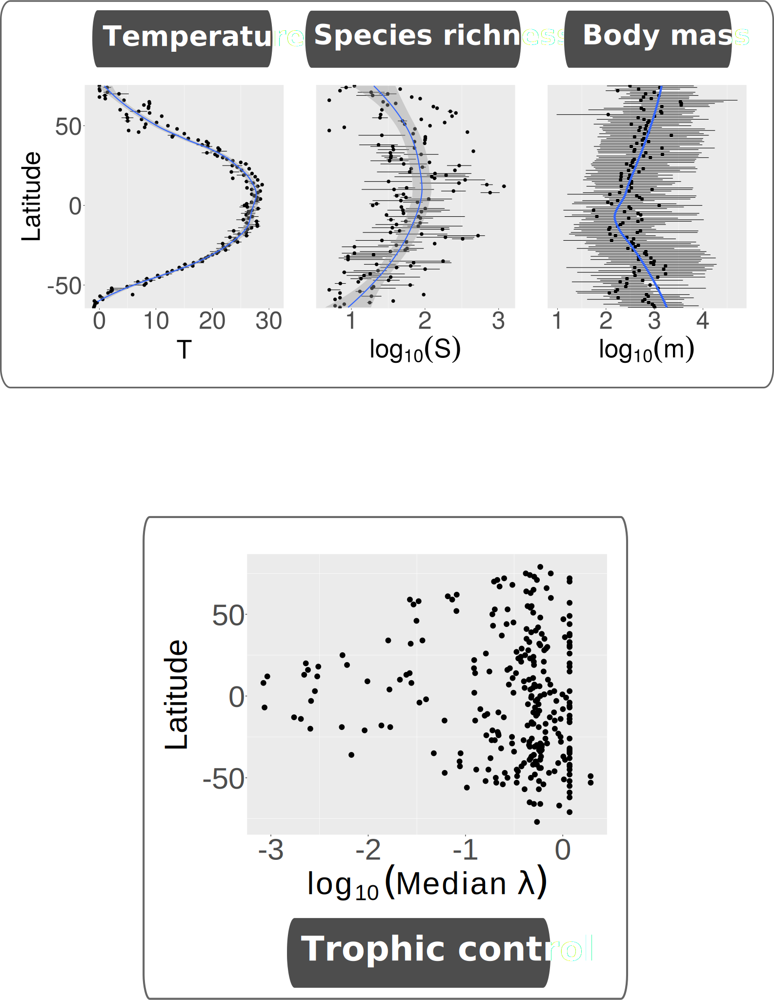
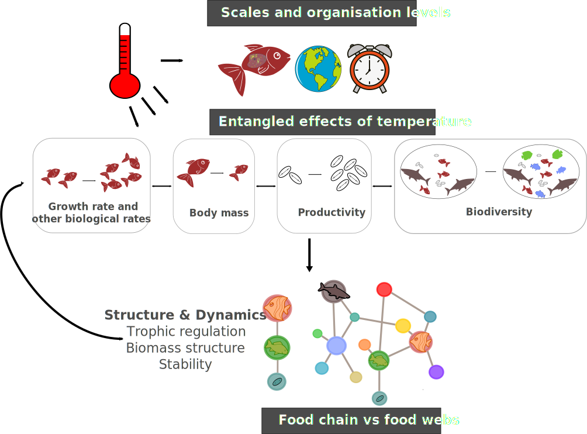

```{r setup, echo = F}
knitr::opts_chunk$set(
  comment = "#",
  #cache = TRUE,
  collapse = TRUE,
  warning = FALSE,
  message = FALSE,
  fig.width = 7,
  fig.height = 5.25,
  fig.align = 'center',
  fig.retina = 3
)

# base plot layout
mypar = list(mar = c(3,3,0.5,0.5), mgp = c(1.5, 0.3, 0), tck = -.008)

# xaringan Extra
xaringanExtra::use_xaringan_extra(c("tile_view", "animate_css", "tachyons"))
xaringanExtra::use_extra_styles(
  hover_code_line = TRUE,         #<<
  mute_unhighlighted_code = TRUE  #<<
)
xaringanExtra::use_editable(expires = 1)
xaringanExtra::use_panelset()
```
class: middle, title-slide

<!-- top logo (comment to remove or edit on `conf/css/style.css:23`) -->
<div class="lab-logo"></div>
<!-- <div class="uni-logo"></div> -->

# Effects of temperature on trophic interactions

<hr width="65%" align="left" size="0.3" color="orange"></hr>
## A perspective across different time scales, spatial scales and organizational levels

### Azenor Bideault <br> Dominique Gravel & Michel Loreau

<br>
<!-- [<i class="fa fa-github fa-lg" style="color:#e7e8e2"></i> Azenor/talk_Econet2021](https://github.com/Azenor/talk_Econet2021) -->

[<i class="fa fa-twitter fa-lg" style="color:#e7e8e2"></i> @Azenor_Bideault](https://twitter.com/Azenor_Bideault)

---
# Ecosystems vary in space

<br>
.center[

<br>
Species are different...]

---
# Important gradients across latitudes

.center[
]

.cite[From Albouy et al [2019]]

---
class: center
# Is there a latitudinal gradient in trophic interaction ?


---
# Importance of trophic interactions in ecosystem functioning

.center[

<br>

Trophic cascades : predators regulate herbivores, enhancing primary producers abundance
.cite[Estes et al [2011]]]

---
# Trophic control

.center[
**Regulation through consumers or resources**

]

<br>
- Dynamical property of consumer-resource systems
- Defined from species biological rates (e.g. interaction rate)

---
# Variation in trophic control across latitudes

.center[]

- Predator-prey cycles in the arctic
- Stronger herbivory and insect predation in the tropics

.center[**What drives these variations in trophic control?**]

.cite[Schemske et al [2009]]

---
class:middle, inverse, center
# Does temperature drive a latitudinal gradient in trophic control?

---
# Temperature induces a major environmental gradient

.center[]

---
# And affects many ecological processes

.center[

**Cell**

Metabolic rate]

---
# And affects many ecological processes

.center[

**Individuals**

Biological rates]

---
# And affects many ecological processes

.center[

**Populations**

Biological rates]

---
# And affects many ecological processes

.center[

**Communities**

Trophic control]

---
# The metabolic view of the world

.center[]

.center[**Metabolism controls higher orders ecological processes : allometric scaling**]

.cite[Gillooly et al [2001], Brown et al [2004]]

---
# Latitudinal variation in trophic control

.center[

Can allometric scaling alone explain the large scale variation in trophic control?]

---
# Latitudinal variation in trophic control

.center[]

- Evolutionary processes might alter the relationship between biological rates and temperature at the population level
- At large scale, other variables might affect trophic control : latitudinal gradient in species richness and body mass

---
# What's on the menu?

.center[]

<br>
1. Are evolutionary processes important in determing the thermal dependence of biological rates?
    - Thermal adaptation of growth rate in wild bacterial strains

---
# What's on the menu?

.center[]

<br>

1. Are evolutionary processes important in determing the thermal dependence of biological rates?
    - Thermal adaptation of growth rate in wild bacterial strains
2. What is the temperture dependence of trophic control for a pair of consumer-resource?
   - Theory on the temperature dependence of trophic control

---
# What's on the menu?


.center[]

<br>

1. Are evolutionary processes important in determining the thermal dependence of biological rates?
    - **Thermal adaptation of growth rate in wild bacterial strains**
2. What is the temperature dependence of trophic control for a pair of consumer-resource?
   - **Theory on the temperature dependence of trophic control**
3. Is there a latitudinal gradient in trophic control and what are its drivers ?
   - **Trophic control in fish food webs at large scales**

---
class: inverse, middle, center
# Thermal adaptation of growth rate in wild bacterial strains

---
# Biological rates & temperature

.center[

<br>
For ectothermic organisms
<br>

How does this relationship vary under thermal adaptation?]

---
# Evolutionary processes : local adaptation

.center[

**Biological rates are optimal at the local temperature**]

---
# Metabolic theory : hotter is faster ...

.center[

**Allometric scaling : increase in biological rates with temperature, strong kinetic constraints (fixed, non-evolvable parameters)**]

---
# Metabolic theory : ... and colder is slower

.center[

**Allometric scaling : increase in biological rates with temperature, strong kinetics constraints (fixed, non-evolvable parameters)**]

---
# Bacteria

.center[Are useful for many things!


<br>
**Key role in many ecological processes**]

- Fast reproduction & small size
- Easily culturable in the lab
- Extrapolate results to other organisms

.center[Experiment on thermal adaptation of growth rate in wild bacterial strains]

---
# Population growth rate

<br>
.center[A key biological process & temperature dependent & easily measurable

<br>

]

---
# Evolutionary experiment

.center[]

---
# Evolutionary experiment

.center[]

---
# Evolutionary experiment

.center[]

---
# Metabolic theory : Hotter is better!

.center[


**Increase in growth rate with temperature, no matter the temperature of evolution**]

---
# To sum-up : Hotter is better!

.center[
]

<br>

Support for :

- Limited local adaptation
- Metabolic theory : allometric scaling of growth rate

<br>
But :

- One experiment
- Bacteria

.cite[Allen et al [2002], Gilloly et al [2007]]

---
# To sum-up : Hotter is better!

.center[
]

<br>

Support for :

- Limited local adaptation
- Metabolic theory : allometric scaling of growth rate

<br>
.center[Suggesting strong kinetics constraints on biological rates : assumption of a fixed relationship between temperature and biological rates across latitudes]

.cite[Allen et al [2002], Gilloly et al [2007]]

---
# From populations to consumer-resource interactions

.center[

<br>

**How does the temperature dependence of population biological rates affect trophic control?**]

---
class: middle, inverse, center
# Theory on the temperature dependence of trophic control

---
# How to measure trophic control?

.center[


**Models are useful**

.font60[(more than bacteria?)]

<br>
Describe consumer-resource systems and measure their dynamical properties such as trophic control]

---
# Model of consumer-resource system

\begin{align}
  \dfrac{dB_i}{dt} &= \textrm{production} \\
  \frac{dB_i}{dt} &= g_iB_i
\end{align}

<br>

.pull-left[
- B biomass
- g<sub>i</sub> growth rate]

.pull-right[

]

---
# Model of consumer-resource system

\begin{align}
  \dfrac{dB_i}{dt} &= \textrm{production} - \textrm{predation losses} \\
  \frac{dB_i}{dt} &= g_iB_i + \epsilon A_{ij} B_iB_j - A_{ki} B_iB_k
\end{align}

<br>

.pull-left[
- B biomass
- g<sub>i</sub> net growth rate
- A<sub>ij</sub> interaction matrix
- *ϵ* conversion efficiency]

.pull-right[

]

---
# Model of consumer-resource system

\begin{align}
  \dfrac{dB_i}{dt} &= \textrm{production} - \textrm{predation losses} \\
  \frac{dB_i}{dt} &= g_iB_i + \epsilon A_{ij} B_iB_j - A_{ki} B_iB_k
\end{align}

<br>

.pull-left[
- B biomass
- g<sub>i</sub> net growth rate
- A<sub>ij</sub> interaction matrix
- *ϵ* conversion efficiency]

.pull-right[

]

---
# Model of consumer-resource system

\begin{align}
  \dfrac{dB_i}{dt} &= \textrm{production} - \textrm{predation losses} - \textrm{internal losses} \\
  \frac{dB_i}{dt} &= g_iB_i + \epsilon A_{ij} B_iB_j - A_{ki} B_iB_k - D_iB_i^2
\end{align}

<br>

.pull-left[
- B biomass
- g<sub>i</sub> net growth rate
- A<sub>ij</sub> interaction matrix
- *ϵ* conversion efficiency
- D<sub>i</sub> self regulation]

.pull-right[

]

---
# Activation energy = thermal sensitivity

.pull-left[.center[]]

.pull-right[
<br><br>

$\huge b_i = b_{0_i}e^{-E_i/kT}$

<br><br>

* b<sub>0</sub>, k constants
* T temperature
* **E activation energy**
]

.center[**How does this temperature dependence translate into trophic control?**]

---
# Measure of trophic control

.center[λ describes the feedback of a trophic level on itself through its predators

]

.cite[Barbier & Loreau [2019]]

---
# Measure of trophic control

.center[λ describes the feedback of a trophic level on itself through its predators

]

.cite[Barbier & Loreau [2019]]

---
# Temperature dependence

.center[Of biological rates

]

---
# Thermal mismatches in biological rates

.center[**Determine trophic control**]

$λ = \dfrac{ϵA_{21}}{D_1D_2}$

Activation energy :
<br>

$E_\lambda =  E_ϵ + 2(E_A-E_{D_2}) + E_{D_2} - E_{D_1}$

.center[]

---
# Database of activation energies

.center[]

.pull-left[
* Various species (ectotherm)
* Taxonomic groups
* Habitat
* Diet]

<br>
.cite[Dell et al [2011], Burnside et al [2014], Fussman et al [2014]]

---
# Temperature dependence of trophic control

.center[
]

- Temperature increases top-down control in aquatic systems
- No effect of temperature on terrestrial ecosystems
- Difference between terrestrial and aquatic communities
- General picture but large variation accross taxonomic groups

---
# To sum-up

.center[]

- Derive a theory describing the temperature dependence of trophic control
- Thermal mismatches in biological rates determine trophic control
- Temperature induces more top-down (predator) control in aquatic systems

---
# From consumer-resource systems to food webs at large scale

.center[]

<br>

.center[
**Is there a latitudinal gradient in trophic control in fish food webs?** <br>
**Is it driven by a direct effect of temperature on biological rates?**]

---
class: inverse, middle, center
# Latitudinal variation in trophic control

---
# Latitudinal gradients


.center[**Temperature**
<br>

]

---
# Other important latitudinal gradients

<br>
.center[


<br>

Which might also affect trophic control]

---
# Method

.center[]
<br>
.cite[Albouy et al [2019], Irigoien et al [2014]]

---
# Parameterize complex food web models

.center[]

- Temperature dependence of biological rates
  - Same activation energy for every species
- Self-regulation : A key but still too mysterious parameter
  - Estimation from assumptions on coexistence and stability and biomass scaling laws

.center[Predictions of trophic control knowing model assumptions]

---
# Gradient in trophic control

.center[


**Increase in top-down control toward the poles**]

*Add schema BU vs TD on legend*

---
# Latitudinal variation

.center[**in trophic control**



Increase in top-down control toward the poles]

---
# Latitudinal variation

.center[**in explanatory variables**



Temperature and species richness peaks in the tropics, smaller body mass]

---
# Relative contributions of the explanatory variables

.center[

**Trophic control is mainly driven by species richness**
]

---
# To sum-up

.center[**Latitudinal variation in trophic control, driven by species richness**]

.center[
]

- Species rich food webs around the equator more bottom-up controlled
- Food webs at high latitudes more top-down controlled (control by predator, trophic cascades, cycles)
- Weak effect of temperature on trophic control in complex food webs

---
# To sum-up

.center[**Latitudinal variation in trophic control, driven by species richness**]

.center[
]

Limitations :

- Limited data available
- No variation in activation energies (but same taxonomic group)
- Model assumptions and parameters

---
class: inverse, center, middle
# Discussion

---
# Take-home messages

.center[
]

<br>

1. Support for limited evolutionary processes but strong kinetic constraints

--
2. Derive a theory for the temperature dependance of trophic control
   - Mainly driven by thermal mismatches in biological rates
   - Increase in top-down control in aquatic systems

--
3. Latitudinal gradient in trophic control in fish food webs
   - Decrease in top-down control toward the equator
   - Mostly driven by species richness

---
# Latitudinal variation in trophic control

.center[]

- Stronger top-down control at high latitudes : predator-prey cycle
- Weaker top-down regulation in tropical food webs
  - Quantifying interaction strength
  - Strong effect of species richness : weak interactions are assumed to promote stability in complex systems

.center[**Importance of species richness**]

.cite[McCann et al [1998], Schemske et al [2009]]

---
# Indirect effect of temperature?

.center[


**Species richness = indirect effect of temperature?**]
<br>

Rates of genetic divergence and speciation governed by metabolic rates? <br>

Opposite effects of temperature :
- direct increase in top-down control through increasing biological rates
- indirect decrease in top-down control through increasing species richness

.cite[Allen et al [2006]]

---
# Complexity of temperature effects

.center[


**Important to understand the entangled effects of temperature across scales** <br>
**Explain latitudinal variation in food web dynamics** <br>]

---
# And predict the impacts of climate change

.center[]

- Bacteria seem to like warm weather !
- Warming can alter trophic control but strong effects of species richness at large scale
- Indirect effects of warming

--
<br>

.center[**Changes are global : climate change but also biodiversity loss**]

---
class: inverse

.pull-left1[
<br>

.font180[Citation]

<br>

**Special thanks to**

- You for listening
- My supervisors Dominique and Michel
- Jury members : Sophie, Marco and John P. Delong
- Committee members : Marco and Arnaud
- Amazing collaborators : Matthieu, Yuval, Nuria, Arnaud, Stéphanie
- Lab mates in Sherbrooke and Moulis
- Will and Steve for hosting me during my stay!
- Housemates, friends and family
]

.pull-right1[
<br>

]
